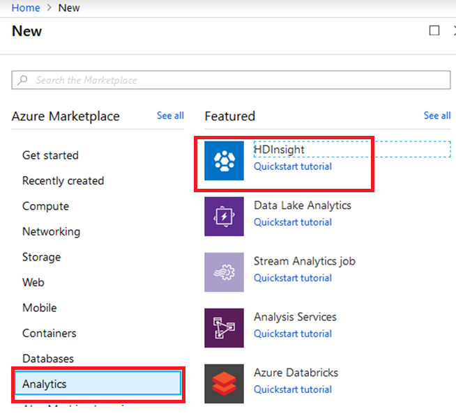

# Get started using Microsoft Academic Graph on Azure HDInsight

Details step-by-step instructions for setting up Microsoft Academic Graph to be used with Azure HDInsight.

## Create Azure HDInsight account

1. Home > Create a resource > Analytics > HDInsight

    

1. Create new HDInsight and Azure storage accounts, following the flow indicated in figure below:

    

    

    > [!IMPORTANT]
    > Both accounts require a globally unique name

## Configure Azure HDInsight to use Microsoft Academic Graph

There are two options to use Microsoft Academic Graph in Azure HDInsight.

1. Attach the Azure storage storing Microsoft Academic Graph to Azure HDInsight (see Step 2 above) and load the graph data with load path (e.g. `/mag/Affiliations.txt`).

1. Without attaching the Azure storage storing Microsoft Academic Graph to Azure HDInsight, using the network file path to the Azure storage and pattern is `wasbs://<container-name>@<storage-name>.blob.core.windows.net/<path/to/file>` (e.g. `wasbs://mag-2018-11-09@microsoftacademicgraph.blob.core.windows.net/mag/Affiliations.txt`).