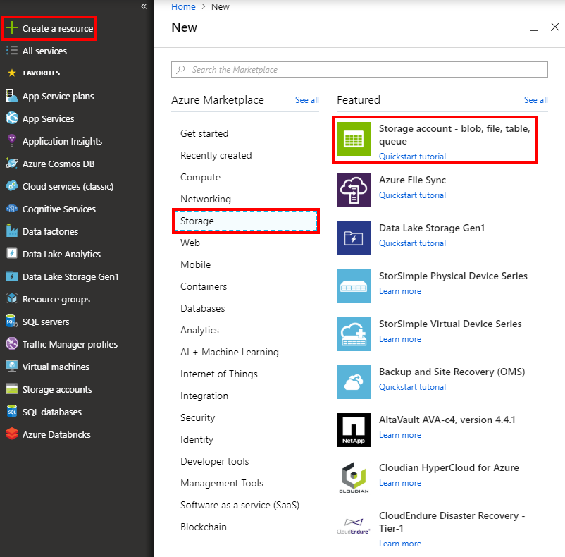
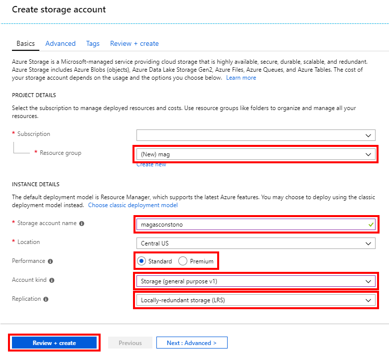
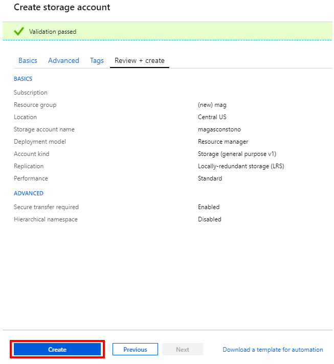
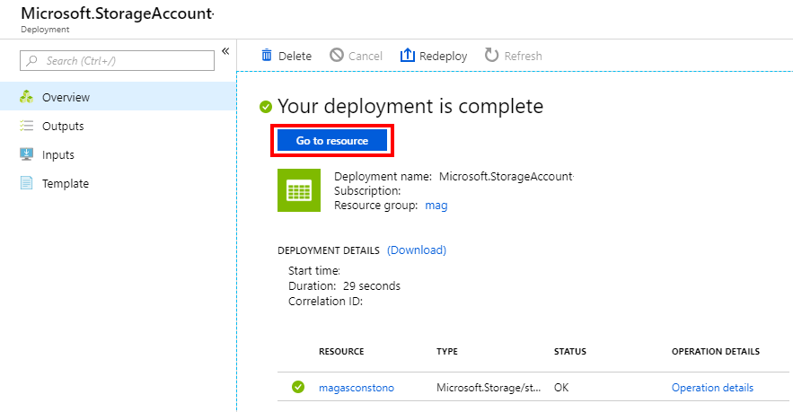
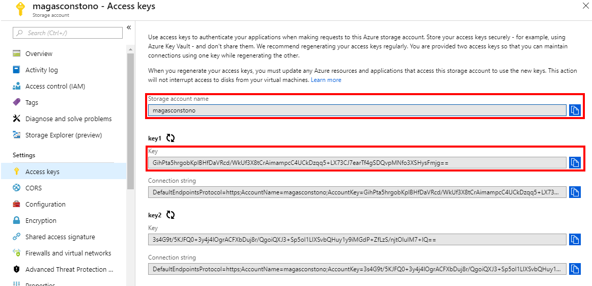
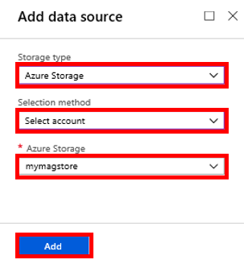

# Get started with Microsoft Academic Graph (MAG) on Azure Storage (AS)

## Open Data License: [ODC-BY](https://opendatacommons.org/licenses/by/1.0/)

When using Microsoft Academic data (MAG, MAKES, etc.) in a product or service, or including data in a redistribution, please acknowledge Microsoft Academic using the URI https://aka.ms/msracad. For publications and reports, please cite the following article:

> Arnab Sinha, Zhihong Shen, Yang Song, Hao Ma, Darrin Eide, Bo-June (Paul) Hsu, and Kuansan Wang. 2015. An Overview of Microsoft Academic Service (MA) and Applications. In Proceedings of the 24th International Conference on World Wide Web (WWW '15 Companion). ACM, New York, NY, USA, 243-246. DOI=http://dx.doi.org/10.1145/2740908.2742839

## Overview

The MA distribution previews (MAG-AS, MAKES) are architected to enable the Microsoft Academic engineering team to push new academic data releases to external Azure storage resources.

## Pre-requisites

- [Azure account + subscription](https://azure.microsoft.com/en-us/get-started)
- [Azure Storage account](https://docs.microsoft.com/en-us/azure/storage/)

## Setup storage account to receive MAG graph releases

### [Create an Azure Subscription](https://azure.microsoft.com/en-us/get-started)

Please create a new Azure subscription for the distribution previews. If your organization already using Azure, this could be a separate subscription under the same tenant id. If you start from scratch, for example “create Azure free account”, the subscription will be created under a new tenant id.

### [Create an Azure Storage Account](https://docs.microsoft.com/en-us/azure/storage/common/storage-quickstart-create-account?tabs=portal)

1. Home > Create a resource > Storage > Storage account

    

1. Specify "mag" for the resource group, “magas<org_name>” for the account name, "Storage (general purpose v1)" for account kind, “LRS” for replication, and “standard” for performance, then click the "review + create" button

    

    > You don’t need to use your organization name after the "magas", however the account name must be unique among all Azure Storage Accounts

    > Select whatever location (region) that is most appropriate for your existing Azure resources

1. Verify that the information you entered is correct and click the "create" button

    

1. Once notified that the storage account has been created, click “go to resource”

    

1. Go to “access keys” and take note of the “storage account name” and the “primary key”

    

## Sign up for MAG provisioning

To sign up for MAG on AS distribution preview, send the following information to <a href="mailto:academicapi@microsoft.com?subject=Access request to Microsoft Academic Graph (MAG) on Azure Storage (AS) distribution preview">academicapi@microsoft.com</a> with the subject "Access request to Microsoft Academic Graph (MAG) on Azure Storage (AS) distribution preview":

- Are you affiliated with a company or university?
  - If company, please provide the company’s name, your department/group and your role
  - If university, please provide the university’s name, department, group/advisor, and your role (undergraduate student, grad student, professor, etc.)
- Brief description of the project you will be using MAG for
- Name of your Microsoft sales representative, if you have one
- Azure storage account name
- Azure storage account primary access key
- Which type of provisioning model you want:
  1. One-time provisioning of the most recent MAG release
  1. Automatic provisioning of each new MAG release (~every 1-2 weeks)

 > NOTE: MAG is currently in a free preview period, so there are no charges associated with the provisioning or use of the data/service itself. However Azure requires you to cover all costs associated with standard resource creation, usage, etc. For cost estimates associated with MAG please see the [Pricing](../resources/pricing.md) page.   Most research institutions have an "Enterprise Account" with Microsoft including Azure subscription. The pricing for Enterprise Accounts differ from the individual account shown in Azure's price calculator.   If you have an Enterprise Account, please check with your individual institution's Information Technology/Computer Center resource on the process of setting up Azure to get MAG. You might need to obtain a "Master Agreement #" and involve MLSP (Microsoft Licensed Solution Provider) for help.

## Create Azure Data Lake accounts

1. Home > Create a resource > Analytics > Data Lake Analytics

    

1. Create new Data Lake Analytics and Data Lake Storage Gen1 accounts, following the flow indicated in figure below:

    

    > Both accounts require a globally unique name

## Configure Azure Data Lake Analytics to use MAG

1. Navigate to the new Azure Data Lake Analytics account created in the step above and add a new data source:

   

1. On the "add data source" dialog, select storage type "azure storage", selection method "select account" and the Azure Storage account you created for MAG provisioning:

   
