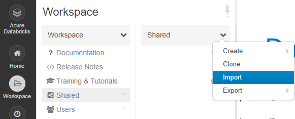
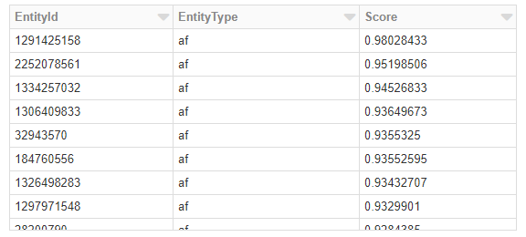
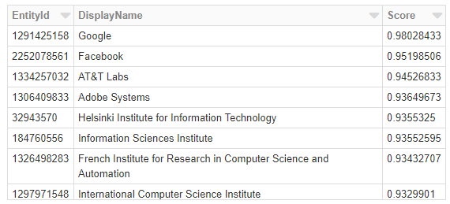

# Network Similarity Sample (Databricks)

In this sample, you compute network similarity score and top related entities in Microsoft Academic Graph (MAG) using Azure Databricks.

## Prerequisites

Complete these tasks before you begin this tutorial:

* Setting up provisioning of Microsoft Academic Graph to an Azure blob storage account. See [Get Microsoft Academic Graph on Azure storage](get-started-setup-provisioning.md).

* Setting up Azure Databricks service. See [Set up Azure Databricks](get-started-setup-databricks.md).

## Gather the information that you need

   Before you begin, you should have these items of information:

   :heavy_check_mark:  The name of your Azure Storage (AS) account containing MAG dataset from [Get Microsoft Academic Graph on Azure storage](get-started-setup-provisioning.md#note-azure-storage-account-name-and-primary-key).

   :heavy_check_mark:  The access key of your Azure Storage (AS) account from [Get Microsoft Academic Graph on Azure storage](get-started-setup-provisioning.md#note-azure-storage-account-name-and-primary-key).

   :heavy_check_mark:  The name of the container in your Azure Storage (AS) account containing MAG dataset.

## Import PySparkMagClass shared notebook

In this section, you import PySparkMagClass.py as a shared notebook in Azure Databricks workspace. You will run this utility notebook from another notebook later.

1. Save **`samples/PySparkMagClass.py`** in MAG dataset to local drive.

1. In the [Azure portal](https://portal.azure.com), go to the Azure Databricks service that you created, and select **Launch Workspace**.

1. On the left, select **Workspace**. From the **Workspace** > **Shared** drop-down, select **Import**.

    
    
1. Drag and drop PySparkMagClass.py to the **Import Notebook** dialog box.

    

1. Select **Import**. This will create a notebook with path `"/Shared/PySparkMagClass"`. No need to run this notebook.

   > [!NOTE]
   > When importing this notebook under **Shared** folder. The full path of this notebook is `"/Shared/PySparkMagClass"`. If you import it under other folders, note the actual full path and use it in following sections.

## Import PySparkNetworkSimilarityClass shared notebook

In this section, you import PySparkNetworkSimilarityClass.py as a shared notebook in Azure Databricks workspace. You will run this utility notebook from another notebook later.

1. Save **`ns/PySparkNetworkSimilarityClass.py`** in MAG dataset to local drive.

1. In Azure Databricks workspace portal, from **Workspace** > **Shared** drop-down, select **Import**.

1. Drag and drop PySparkNetworkSimilarityClass.py to the **Import Notebook** dialog box.

1. Select **Import**. This will create a notebook with path `"/Shared/PySparkNetworkSimilarityClass"`. No need to run this notebook.

## Run sample notebook

In this section, you import NetworkSimilaritySample.py as a notebook in Azure Databricks workspace and run the notebook.

1. Save **`ns/NetworkSimilaritySample.py`** in MAG dataset to local drive.

1. In Azure Databricks workspace portal, from the **Workspace** > **Users** > **Your folder** drop-down, select **Import**.

1. Drag and drop NetworkSimilaritySample.py to the **Import Notebook** dialog box.

1. Replace `<AzureStorageAccount>`, `<AzureStorageAccessKey>`, and `<MagContainer>` placeholder values with the values that you collected while completing the prerequisites of this sample.

   |Value  |Description  |
   |---------|---------|
   |**`<AzureStorageAccount>`** | The name of your Azure Storage account. |
   |**`<AzureStorageAccessKey>`** | The access key of your Azure Storage account. |
   |**`<MagContainer>`** | The container name in Azure Storage account containing MAG dataset, Usually in the form of **mag-yyyy-mm-dd**. |

1. Click **Run All** button.

## Script description

### Creating a NetworkSimilarity instance

- Cmd 5 creates a NetworkSimilarity instance to compute similarity

   ```python
   ns = NetworkSimilarity(container=MagContainer, account=AzureStorageAccount, key=AzureStorageAccessKe, resource=ResourcePath)
   ```

### Getting similarity score between two entities

- Cmd 6 calls getSimilarity method to get similarity score between two entities

   ```python
   score = ns.getSimilarity(EntityId1, EntityId2)
   print(score)
   ```

- You will see output as follows

    > 0.7666980387511901

### Getting top related entities

- Cmd 7 calls getTopEntities method to get top related entities

   ```python
   topEntities = ns.getTopEntities(EntityId1)
   display(topEntities)
   ```

- You will see output as follows

    

### Getting entity details

- Cmd 8 joins top entities with affiliation table to get entity details

   ```python
   # Create a MicrosoftAcademicGraph instance to access MAG dataset
   mag = MicrosoftAcademicGraph(container=MagContainer, account=AzureStorageAccount, key=AzureStorageAccessKe)

   # Get authors dataframe
   affiliations = mag.getDataframe('Affiliations')

   # Join top entities with authors to show auhtor names
   topEntitiesWithName = topEntities \
       .join(affiliations, topEntities.EntityId == affiliations.AffiliationId, 'inner') \
       .select(topEntities.EntityId, affiliations.DisplayName, topEntities.Score) \
       .orderBy(topEntities.Score.desc())
   display(topEntitiesWithName)
   ```

- You will see output for Cmd 8 as follows

    

## Clean up resources

After you finish the tutorial, you can terminate the cluster. From the Azure Databricks workspace, select **Clusters** on the left. For the cluster to terminate, under **Actions**, point to the ellipsis (...) and select the **Terminate** icon.

If you don't manually terminate the cluster, it automatically stops, provided you selected the **Terminate after \_\_ minutes of inactivity** check box when you created the cluster. In such a case, the cluster automatically stops if it's been inactive for the specified time.

## Resources

* [Create an Azure Databricks service](https://azure.microsoft.com/services/databricks/)
* [Create a cluster for the Azure Databricks service](https://docs.azuredatabricks.net/user-guide/clusters/create.html)
* [Import this notebook and attach it to the cluster](https://docs.databricks.com/user-guide/notebooks/notebook-manage.html#import-a-notebook)
