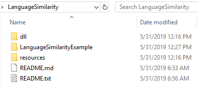

# Network Similarity Package

The Microsoft Academic Network Similarity Package provides supplementary processing functionality for use with the Microsoft Academic Graph (MAG). This package includes Network Embedding resources and functions/scripts using Azure Data Lake Analytics (U-SQL) and Azure Databricks (PySpark).

1. Similarity comparison between 2 entities using pre-trained network embeddings on the MAG corpus, and
2. Compute top similar entities based on the pre-trained network embeddings.

## Prerequisites

Before running these examples, you need to complete the following setups:

* Setting up provisioning of Microsoft Academic Graph to an Azure blob storage account. See [Get Microsoft Academic Graph on Azure storage](get-started-setup-provisioning.md).

* Request Network Similarity Package when requesting MAG.

  > [!NOTE]
  > Network Similarity Package is not included in basic MAG distribution. Please ask for Network Similarity Package when requesting MAG. Otherwise it will not be included in your distribution.

## Contents

The Network Similarity package is distributed in a separate folder (ns) in MAG.

  

The LanguageSimilarity package is distributed as a single zip file. It includes algorithms in dlls, and resources with pre‑trained models. After unzipping the package, users will see a folder structure as shown in the figure below. README files contain general information about the package, system requirements, and API signatures.

  

We also include a C# demo project in the LanguageSimilarityExample folder. It contains sample.txt as a sample input for the demo project.
The demo project is a console program which takes resource directory and the sample.txt path file as paremeters. The resource directory is to initialize the language similarity models, while sample.txt is used to provide prarmeters for calling methods in this package.

## Methods

* [ComputeSimilarity](language-similarity-computesimilarity.md)
* [GetTopFieldsOfStudy](language-similarity-gettopfieldsofstudy.md)

## Example

* [LanguageSimilarityExample](language-similarity-example.md)

## Resources

* [Get started with Azure Data Lake Analytics using Azure portal](https://docs.microsoft.com/azure/data-lake-analytics/data-lake-analytics-get-started-portal)
* [Data Lake Analytics](https://azure.microsoft.com/services/data-lake-analytics/)
* [U-SQL Language Reference](https://docs.microsoft.com/u-sql/)
