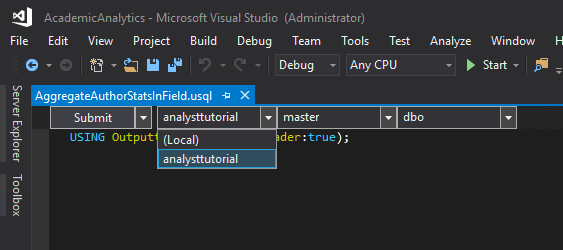
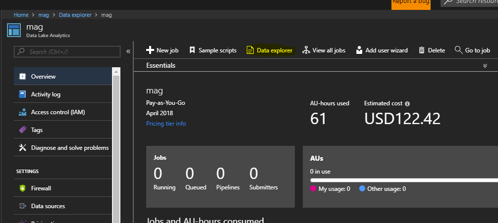

# Analytics and visualization samples for Microsoft Academic Graph

Illustrates how to perform analytics and visualization for Microsoft Academic Graph using Data Lake Analytics (USQL) and Power BI.

## Sample projects

* [Field of Study Top Authors](https://github.com/Azure-Samples/academic-knowledge-analytics-visualization/tree/master/src/AcademicAnalytics/01.%20Field%20of%20Study%20Top%20Authors)
* [Field of Study Entity Counts](https://github.com/Azure-Samples/academic-knowledge-analytics-visualization/tree/master/src/AcademicAnalytics/11.%20Field%20of%20Study%20Entity%20Counts)
* [Field of Study Top Entities](https://github.com/Azure-Samples/academic-knowledge-analytics-visualization/tree/master/src/AcademicAnalytics/13.%20Field%20of%20Study%20Top%20Entities)
* [Conference Top Authors By Static Rank](https://github.com/Azure-Samples/academic-knowledge-analytics-visualization/tree/master/src/AcademicAnalytics/02.%20Conference%20Top%20Authors%20By%20Static%20Rank)
* [Conference Paper Statistics](https://github.com/Azure-Samples/academic-knowledge-analytics-visualization/tree/master/src/AcademicAnalytics/03.%20Conference%20Papers%20Basic%20Statistics)
* [Conference Top Papers](https://github.com/Azure-Samples/academic-knowledge-analytics-visualization/tree/master/src/AcademicAnalytics/04.%20Conference%20Top%20Papers)
* [Conference Top Authors](https://github.com/Azure-Samples/academic-knowledge-analytics-visualization/tree/master/src/AcademicAnalytics/05.%20Conference%20Top%20Authors)
* [Conference Top Institutions](https://github.com/Azure-Samples/academic-knowledge-analytics-visualization/tree/master/src/AcademicAnalytics/06.%20Conference%20Top%20Institutions)
* [Conference Memory of References](https://github.com/Azure-Samples/academic-knowledge-analytics-visualization/tree/master/src/AcademicAnalytics/07.%20Conference%20Memory%20of%20References)
* [Conference Top Referenced Venues](https://github.com/Azure-Samples/academic-knowledge-analytics-visualization/tree/master/src/AcademicAnalytics/08.%20Conference%20Top%20Referenced%20Venues)
* [Conference Top Citing Venues](https://github.com/Azure-Samples/academic-knowledge-analytics-visualization/tree/master/src/AcademicAnalytics/09.%20Conference%20Top%20Citing%20Venues)
* [Organization Insight](https://github.com/Azure-Samples/academic-knowledge-analytics-visualization/tree/master/src/AcademicAnalytics/12.%20Organization%20Insight)

## Getting started with sample projects

### Pre-requisites

* [Microsoft Academic Graph on Azure blob storage](get-started-setup-provisioning.md)
* [Azure Data Lake Analytics account with Microsoft Academic Graph as data source](get-started-setup-azure-data-lake-analytics.md)
* [Microsoft Power BI Desktop client](https://powerbi.microsoft.com/en-us/desktop/)
* Visual Studio 2017 or Visual Studio 2015 with [Data Lake tools](https://www.microsoft.com/en-us/download/details.aspx?id=49504)

### Quick-start

1. Download or clone the [samples repository](https://github.com/Azure-Samples/academic-knowledge-analytics-visualization/)
2. Open the solution /src/AcademicAnalytics.sln
3. Take a look at the academic graph data schema and run CreateDatabase.usql from [common scripts](https://github.com/Azure-Samples/academic-knowledge-analytics-visualization/tree/master/src/AcademicAnalytics/00.%20Common%20Scripts)
4. For each tutorial there should be: A USQL script(.usql), a Power BI report (.pbix), a Power BI template (.pbit) and a README explaining the tutorial.
5. Although each tutorial is different, running the USQL script as is and filling out the Power BI template using the same USQL parameters should give you a Power BI report with visualizations that match the Power BI report example included in the tutorial. Since the Microsoft Academic graph is contently improving, different graph versions may give you slightly different results.

## Working with USQL scripts

* How to run USQL scripts
  * Make sure you have selected your Data Lake account

    

  * Build the script first to validate syntax

    

  * Submit your script to your Data Lake account

    

* How to view USQL results in Azure portal

    

    

## Using Power BI

> [!IMPORTANT]
> Make sure USQL script finished successfully

* Open up corresponding Power BI Template (.pbit) from file explorer (Visual studio doesn't recognize Power BI files)
* Enter your ADL information and parameters corresponding to your scripts

    

* Make sure the parameters cases are the same as your script and "click" to load

## Resources

* [Get started with Azure Data Lake Analytics using Azure portal](https://docs.microsoft.com/en-us/azure/data-lake-analytics/data-lake-analytics-get-started-portal)
* [Develop USQL scripts by using Data Lake Tools for Visual Studio](https://docs.microsoft.com/en-us/azure/data-lake-analytics/data-lake-analytics-data-lake-tools-get-started)
* [Get started with USQL](https://docs.microsoft.com/en-us/azure/data-lake-analytics/data-lake-analytics-u-sql-get-started)
* [Deep Dive into Query Parameters and Power BI Templates](https://powerbi.microsoft.com/en-us/blog/deep-dive-into-query-parameters-and-power-bi-templates/)
* [Manage Azure Data Lake Store resources by using Storage Explorer](https://docs.microsoft.com/en-us/azure/data-lake-store/data-lake-store-in-storage-explorer)
* [Scalable Data Science with Azure Data Lake: An end-to-end walk-through](https://docs.microsoft.com/en-us/azure/machine-learning/team-data-science-process/data-lake-walkthrough)
* [Microsoft Academic Website](https://academic.microsoft.com/)