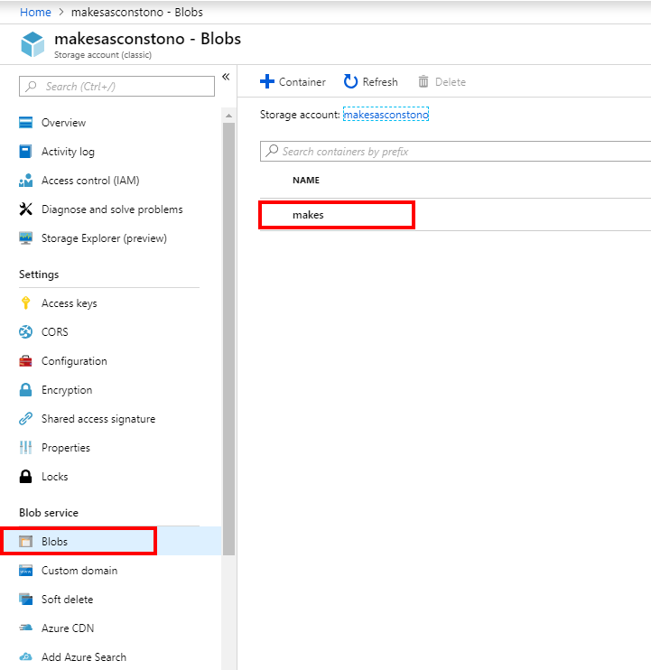
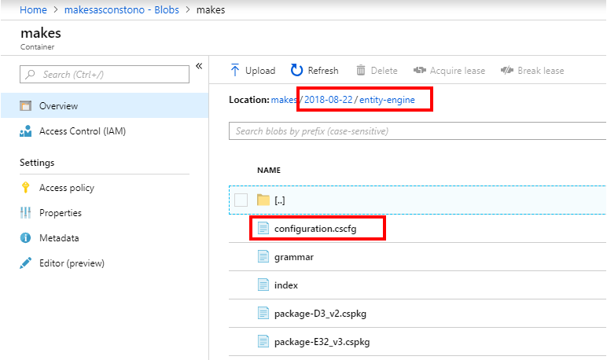
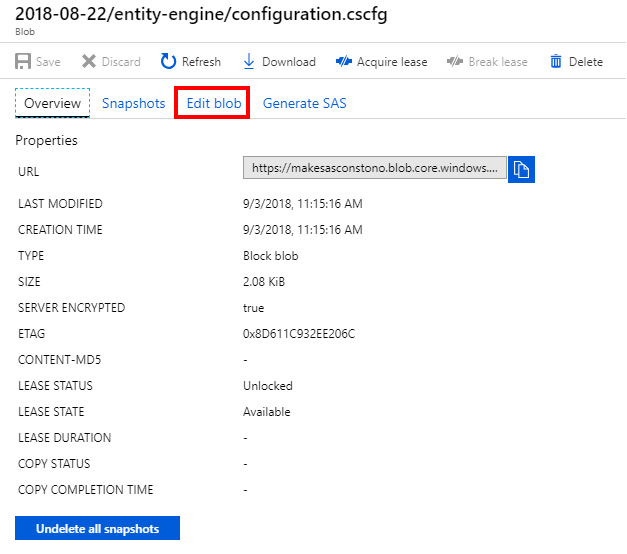
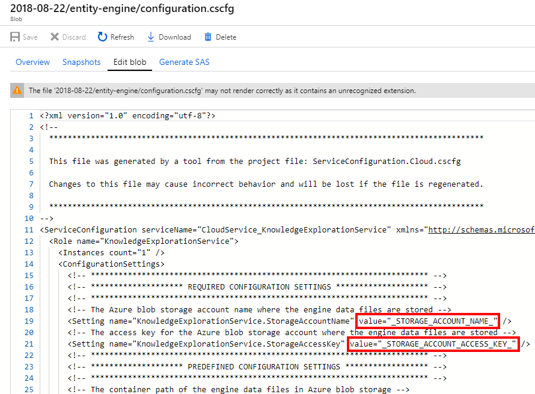
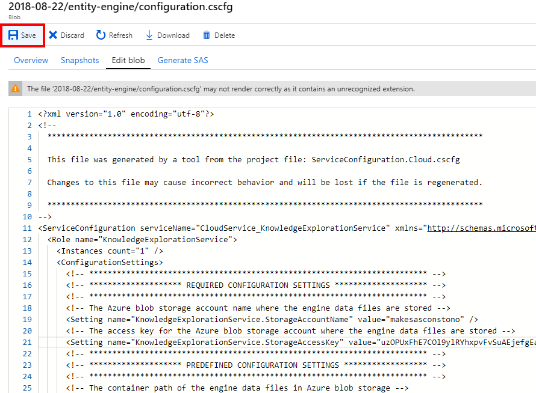
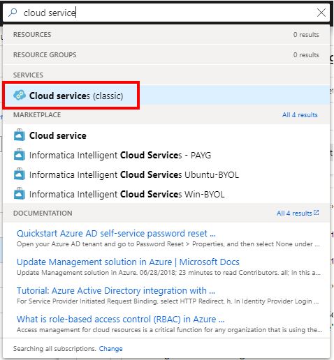
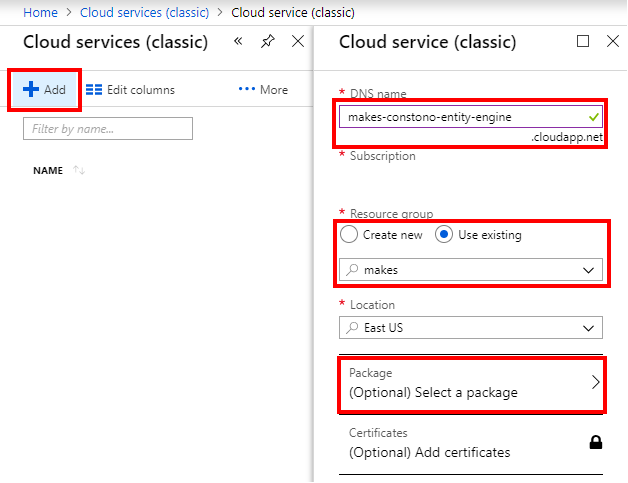
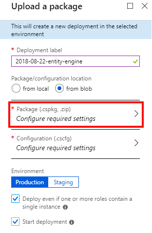
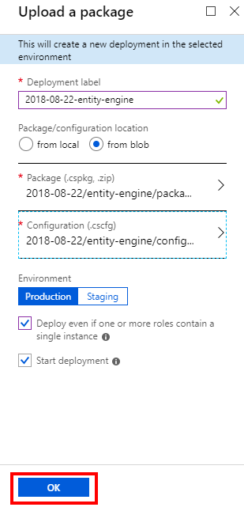
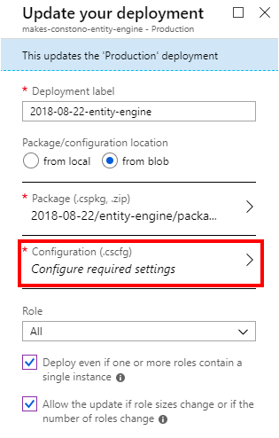

# Deploy Microsoft Academic Knowledge Exploration Service API using Azure Management Portal

> [!IMPORTANT]
> We will be publishing a new version of MAKES in early 2020.  This version will be a turn-key solution to host MAKES in your Azure subscription.  For users of Project Academic Knowledge, this MAKES version will mirror the schema and API methods supported by Project Academic Knowledge, enabling users to host their own un-throttled version of the API.

Details step-by-step guide for deploying Microsoft Academic Knowledge Exploration Service APIs using the Azure Management Portal.

## Configure API build

Before deploying a new MAKES API build it must first be configured to use the Azure storage account created to contain the builds.

### Load configuration file of MAKES API you want to deploy

1. Navigate to the Azure storage account

    

1. Navigate to the "makes" container in the "blobs" service tab

    

1. Navigate to the MAKES API directory of the MAKES version you want to deploy and click the "configuration.cscfg" blob

    

### Edit the "configuration.cscfg" blob

1. From the configuration.cscfg blob screen click the "edit blob" tab

    

1. Change “_STORAGE_ACCOUNT_NAME_” to the Azure storage account name and “_STORAGE_ACCOUNT_ACCESS_KEY” to the Azure storage account primary key, then click “save”

    
    

    > [!IMPORTANT]
    > Make sure to do this for **each MAKES API you want to deploy**, i.e. if you want to deploy both the semantic-interpretation-engine and the entity-engine you will need to modify each APIs configuration file separately

    > [!IMPORTANT]
    > This only needs to be done **ONCE** for each new MAKES API build version

## Deploy MAKES API to new cloud service

1. Click the search box, type “cloud services” and click the “Cloud services (classic)” option

    

2. Add a new cloud service with a unique DNS name, using the same resource group that the Azure storage account is in, then click the “select a package” option

    

3. Enter a descriptive deployment label for the cloud service, check “deploy even if one or more roles contain a single instance”, and click “from blob” for package/configuration location

    

4. Select MAKES API package

    Click "Package (.cspkg, .zip)"

    

    Enter the name of the Azure storage account you’re using for MAKES API builds, click the result and then click the “makes” container

    

    Navigate to the MAKES API build you want to deploy and click the package file (.cspkg) that corresponds to the type of cloud service type you want to host the API on, then click “select”

    

    > [!IMPORTANT]
    > The name part after “package-“ corresponds to different types of pre-configured cloud service instances [detailed here](https://azure.microsoft.com/pricing/details/cloud-services/). **PLEASE NOTE THAT COSTS ASSOCIATED WITH DIFFERENT INSTANCE TYPES CAN VARY DRAMATICALLY.** See the “cloud service deployment options” section in the appendix for cost/benefit details of the different pre-configured cloud instance types.

5. Select the MAKES API configuration

    Click “Configuration (.cscfg)”

    

    Enter the name of the Azure storage account you’re using for MAKES API builds, click the result and then click the “makes” container

    

    Navigate to the MAKES API build you want to deploy, click the configuration file (.cscfg) and then click “select”

    

6. Click "OK"

    

7. Click "Create"

    

8. Wait for deployment to complete and MAKES API to fully come online

    Click the “go to resource” button once the cloud service deployment completes

    

    Verify that cloud service instance status is “starting”

    

    Wait for cloud service instance status to show “running”

    

9. Verify that the new MAKES API instance is working

    To verify the entity API is working, navigate to https://your-entity-engine-cloud-service.cloudapp.net/evaluate?expr=And(Composite(AA.AuN=='darrin%20eide'),Ti=='an%20overview%20of%20microsoft%20academic%20service%20mas%20and%20applications')&attributes=Id,Ti&count=1 and verify “an overview of microsoft academic service mas and applications” is returned

    

    To verify the semantic interpretation API is working, navigate to https://your-semantic-interpretation-engine-cloud-service.cloudapp.net/interpret?query=darrin%20eide%20an%20overview%20of&complete=1&count=1 and verify that the top interpretation contains the expression “And(Composite(AA.AuN=='darrin eide'),Ti=='an overview of microsoft academic service mas and applications')”

    

## Update existing MAKES API deployment with new build

1. Click the “update” button on the “overview” section of the cloud service to be updated

    

2. Enter a descriptive deployment label for the deployment, check “deploy even if one or more roles contain a single instance”, check “allow the update if role sizes change…” and click “from blob” for package/configuration location

    

3. Select MAKES API package

    Click “Package (.cspkg, .zip)”

    

    Enter the name of the Azure storage account you’re using for MAKES API builds, click the result and then click the “makes” container

    

    Navigate to the MAKES API build you want to deploy and click the package file (.cspkg) that corresponds to the type of cloud service type you want to host the API on, then click “select”

    

    > [!IMPORTANT]
    > The name part after “package-“ corresponds to different types of pre-configured cloud service instances [detailed here](https://azure.microsoft.com/pricing/details/cloud-services/). **PLEASE NOTE THAT COSTS ASSOCIATED WITH DIFFERENT INSTANCE TYPES CAN VARY DRAMATICALLY.** See the “cloud service deployment options” section in the appendix for cost/benefit details of the different pre-configured cloud instance types.

4. Select the MAKES API configuration

    Click “Configuration (.cscfg)”

    

    Enter the name of the Azure storage account you’re using for MAKES API builds, click the result and then click the “makes” container

    

    Navigate to the MAKES API build you want to deploy, click the configuration file (.cscfg) and then click “select”

    

5. Click "OK"

    

6. Click "Create"

    

7. Wait for deployment to complete and MAKES API to fully come online

    Click the “go to resource” button once the cloud service deployment completes

    

    Verify that cloud service instance status is “starting”

    

    Wait for cloud service instance status to show “running”

    

8. Verify that the new MAKES API instance is working

    To verify the entity API is working, navigate to https://your-entity-engine-cloud-service.cloudapp.net/evaluate?expr=And(Composite(AA.AuN=='darrin%20eide'),Ti=='an%20overview%20of%20microsoft%20academic%20service%20mas%20and%20applications')&attributes=Id,Ti&count=1 and verify “an overview of microsoft academic service mas and applications” is returned

    

    To verify the semantic interpretation API is working, navigate to https://your-semantic-interpretation-engine-cloud-service.cloudapp.net/interpret?query=darrin%20eide%20an%20overview%20of&complete=1&count=1 and verify that the top interpretation contains the expression “And(Composite(AA.AuN=='darrin eide'),Ti=='an overview of microsoft academic service mas and applications')”

    